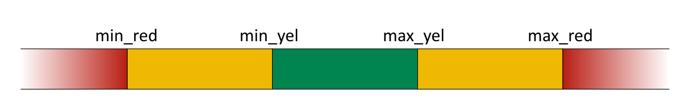

```{r, include = FALSE}
knitr::opts_chunk$set(
  collapse = TRUE,
  comment = "#>"
)
```

```{r setup}
library(piamValidation)
```


# Overview

The function `validateScenarios()` performs validation checks on IAM scenario 
data based on thresholds provided in a tailored config file. These checks either 
analyse the agreement with historical reference data or expectations on the 
scenario data.

# Installation

The package is available via the R package repository of PIK. 

```{r installation, eval = FALSE}
install.packages("piamValidation", repos = "https://rse.pik-potsdam.de/r/packages")
```

For more detailed information please refer to the 
[Readme](https://github.com/pik-piam/piamValidation/tree/main?tab=readme-ov-file#installation).

# Usage

## REMIND output script

When working directly with REMIND, a script comes shipped with the code which 
will make it easy to perform a basic scenario validation. Go to  the REMIND 
directory ``remind/`` and call ``Rscript output.R``. Then choose "Comparison 
across runs" and "validateScenarios". Select the runs of interest and choose
one of the ``validationConfigs`` that are available via ``piamValidation``.
If you are not sure which config to choose, "default" is a good starting point.

## Scenario Validation

More generally, the function ``piamValidation::validateScenarios()`` performs 
all necessary steps of the validation process. It takes the config file and 
iterates through each row, assembling the required scenario and reference data 
and checking the thresholds.

The output is a data.frame, which combines scenario and reference data with
the threshold that is applied to each respective data point and the result of 
the validation checks.
These results can be found in the columns ``check_value`` and ``check``, with 
the former containing the value that is directly compared to the thresholds (
e.g. the calculated growth rate when doing a growth rate check) and the latter
being the result in form of a traffic-light color.

{width=80%}

Using ``piamValidation::validateScenarios()`` with the argument 
``extraColors = TRUE`` (default: ``TRUE``) enables a differentiation between 
violating lower vs. upper bounds (note that the threshold names ``min_red`` and 
``min_yel`` do not change).

{width=80%}

Optionally, you can save the resulting data.frame to a .csv file by providing
an ``outputFile``.

```{r run validation, eval = FALSE}
df <- validateScenarios(c(scenPath, histPath), config, outputFile = NULL)
```

The function argument ``config`` can be either the name of a config file found
in ``piamValidation`` (find the name via 
``inst/config/validationConfig_<name>.csv``) or a full path to a config file.

## Validation Report

To perform the validation and create an output document in one go, the function
``piamValidation::validationReport()`` can be used. It calls ``validateScenarios`` 
and additionally renders an .html file which features heat maps for all 
variables described in the config file.

By default, the .Rmd ``validation_default`` is used, but alternatives can be 
used or created according to individual needs in ``inst/markdown``.

The report is saved in a folder called ``output`` in the current working 
directory.

-> Be careful when using this function on big data sets and configs with many
variables as it might create very large html files.

```{r create report, eval = FALSE}
validationReport(c(scenPath, histPath), config, report = "default")
```

## Scenario Data

You can pass IAMC-style .mif, .csv or .xlsx files or vectors of paths to the 
function. More precisely, any data file which can be read by
``quitte::read.quitte()`` featuring the columns: 

*Model, Scenario, Region, Variable, Unit, \<years\>*

## Reference Data

Reference data should follow the same format guidelines as scenario data with 
the exception that the ``scenario`` column needs to read ``historical``. It is 
passed to the validation function together with the scenario data as part of the 
``dataPath`` argument, e.g.:

``validateScenarios(dataPath = c("<path_to_scenario_data>", "<path_to_reference_data>"),
config = ...)``


## Configuration File

The config file is the place where the validation checks are defined. It offers
a lot of flexibility for many different types of check but writing the file also 
comes with a few rules - depending on the type of check which should be
performed, different columns can or need to be filled.

{width=100%}

**General Rules**

- one set of thresholds per row is allowed
- empty rows and rows without "variable" are ignored and can be used to structure the config
- later rows overwrite earlier rows if there is a data overlap
- only one reference period/model/scenario per data-slice (e.g. don't compare the same data against ref_model1 and ref_model2)


### Columns

*Comparison Type*

**metric**: decide which type of comparison will be performed, currently 
supported: ``relative, difference, absolute, growthrate``
            
**critical**: is it considered to be a critical check? the function 
``validationPass`` will only complain about failed checks if this is set to "yes"
            
            
            
*Which data will be validated?*

**variable**: choose one or multiple variables to be checked; define multiple 
variables via "\*" (one sub-level) or "\*\*" (all sub-levels)

**unit**: see paragraph below

**model**: choose one or multiple (comma-separated) models, or leave empty to choose all

**scenario**: choose one or multiple (comma-separated) scenarios, or leave empty to choose all

**region**: choose one or multiple (comma-separated) regions, or leave empty to choose all

**period**: choose one or multiple (comma-separated) periods, or leave empty to choose all
(for historical checks: ``2005 - 2020``, all other cases: ``< 2100``). You can also select a range via ``yyyy-yyyy``.
          
          
          
*Thresholds*

**min/max_yel/red**: minimum and maximum thresholds which decide whether a check
is passed (``green``), produces a warning (``yellow``) or is failed (``red``). 
If reference data is missing the result will be ``grey``. Each line needs at 
least one threshold. ``relative`` thresholds can be given either as percentage 
(``20%``) or decimal (``0.2``).
          
          
          
*What are we comparing to?*

**ref_model**: for model comparison set a reference model here, also setting 
the column ``model`` is recommended to avoid comparing a model to itself

**ref_scenario**: this column can be used in two ways - either compare two scenarios
produced by the same model to one-another (similar to model comparison), or set 
it to ``historical`` to compare model data to observational data provided by 
one or multiple external sources.

It is recommended to choose a historical reference source explicitly in the 
"ref_model" column for historical comparisons. Otherwise, all available 
historical sources will be averaged and the tooltip of a heat map will show
``ref_model = "multiple"``.

**ref_period**: compare data between different periods, set the reference period
here


### Units

It is recommended to include the unit of each variable in the config file to
avoid inconsistency between data sources. The tool performs checks, whether the
units in the config match those in scenario and reference data and returns a 
warning in case they don't. This check is performed using 
``piamInterfaces::areUnitsIdentical()`` to avoid false positives.

In case scenario or reference data contains variables with multiple units, it
will be filtered for the units matching those from the config file.

If the ``unit`` column is left empty, no consistency check will be performed.
This is the recommended approach when selecting multiple variables in one go via
``**``, which don't all share the same unit.

## Use Cases

To give some examples how to define various validation checks, see the 6 use
cases below.

### Use Case 1: relative comparison to reference data

You want to compare your scenario data to an external reference source, which 
provides historical (or projected) data for the variable you are interested in.
The thresholds are defined as a ``relative`` deviation above or below the 
reference value: $\textrm{relDeviation} = \frac{(\textrm{scenValue} - \textrm{refValue})}{\textrm{refValue}}$.

Example:

| metric   | critical | variable     | unit |model | scenario | region | period | min_red | min_yel | max_yel | max_red | ref_model | ref_scenario | ref_period |
|----------|----------|--------------|-------|-------|----------|--------|--------|---------|---------|---------|---------|-----------|--------------|------------|
| relative | yes      | Emi\|CO2\|Energy | Mt CO2/yr    |   |          |        |        | -0.25   | -0.2    | 0.2     | 0.25    | EDGAR8    | historical   |            |
| relative | yes      | Emi\|CO2\|Energy | Mt CO2/yr    |   |          | World  |        | -0.2    | -0.1    | 0.1     | 0.2     | EDGAR8    | historical   |            |


### Use Case 2: difference to reference data

You want to compare your scenario data to an external reference source, which 
provides historical (or projected) data for the variable you are interested in.

The thresholds are defined as a ``difference`` (above or below) to the 
reference value: $\textrm{difference} = \textrm{scenValue} - \textrm{refValue}$.

Example:

| metric   | critical | variable     | unit |model | scenario | region | period | min_red | min_yel | max_yel | max_red | ref_model | ref_scenario | ref_period |
|----------|----------|--------------|-------|-------|----------|--------|--------|---------|---------|---------|---------|-----------|--------------|------------|
| difference | yes      | Emi\|CO2\|Energy | Mt CO2/yr    |   |          |        |        | -100   | -50    | 50     | 100    | EDGAR8    | historical   |            |
| difference | yes      | Emi\|CO2\|Energy | Mt CO2/yr    |   |          | World  |        | -500    | -200    | 200     | 500     | EDGAR8    | historical   |            |

### Use Case 3: relative comparison to other model/scenario/period

You want to compare your scenario data to itself, either by comparing periods,
scenarios or models to one another. You select one or multiple 
periods/scenarios/models in the respective "period/scenario/model" column and
*exactly* one in the "ref_period/scenario/model" column.

The thresholds are defined as a ``relative`` deviation above or below the 
reference value: $\textrm{relDeviation} = \frac{(\textrm{scenValue} - \textrm{refValue})}{\textrm{refValue}}$.

Example:

| metric   | critical | variable     | unit |model | scenario | region | period | min_red | min_yel | max_yel | max_red | ref_model | ref_scenario | ref_period |
|----------|----------|--------------|-------|-------|----------|--------|------|---------|---------|---------|---------|-----------|--------------|------------|
| relative | yes      | Emi\|CO2\|Energy | Mt CO2/yr | REMIND |     |   |       |  -20%   |  -10%   |  10%    |   20%   | MESSAGE    |    |            |
| relative | yes      | Emi\|CO2\|Energy | Mt CO2/yr |   | NDC |       |       |         |  |  -25%   |  -10%   |       |  CurPol |            |
| relative | yes      | Emi\|CO2\|Energy | Mt CO2/yr |   | CurPol  |   | 2030   |   10%   |   20%   |   60%   |   80%   |  | |  2020          |
| relative | yes      | Emi\|CO2\|Energy | Mt CO2/yr |   | NDC     |   | 2030   | -20%    |  -10%   |   20%   |   40%   |  | |  2020          |

Currently, there is no support to compare different regions or variables to one another.

### Use Case 4: difference to other model/scenario/period

You want to compare your scenario data to itself, either by comparing periods,
scenarios or models to one another. You select one or multiple 
periods/scenarios/models in the respective "period/scenario/model" column and
*exactly* one in the "ref_period/scenario/model" column.

The thresholds are defined as a ``difference`` (above or below) to the 
reference value: $\textrm{difference} = \textrm{scenValue} - \textrm{refValue}$.

Example:

| metric   | critical | variable     | unit |model | scenario | region | period | min_red | min_yel | max_yel | max_red | ref_model | ref_scenario | ref_period |
|----------|----------|--------------|-------|-------|----------|--------|------|---------|---------|---------|---------|-----------|--------------|------------|
| difference | yes      | Emi\|CO2\|Energy | Mt CO2/yr | REMIND |     | World | 2020  |  -1500   |  -500   |  500  |   1500  | MESSAGE    |    |            |
| difference | yes      | Emi\|CO2\|Energy | Mt CO2/yr |   | NDC |    |   |       |                  |  -25%   |  -10%   ||  CurPol |           |
| difference | yes      | Emi\|CO2\|Energy | Mt CO2/yr |   | CurPol  |   | 2030   |   10%   |   20%   |   60%   |   80%   |  | |  2020          |
| difference | yes      | Emi\|CO2\|Energy | Mt CO2/yr |   | NDC     |   | 2030   | -20%    |  -10%   |   20%   |   40%   |  | |  2020          |

### Use Case 5: direct comparison to absolute thresholds

You want to compare your scenario data to explicit values. This could be the
case if you want to do sanity checks on variables that should never leave a 
certain range or you have expert guesses on ``absolute`` upper or lower thresholds.

The tool checks whether $\textrm{minRed/Yel} < \textrm{scenValue} < \textrm{maxYel/Red}$.

Example:

| metric   | critical | variable     | unit |model | scenario | region | period | min_red | min_yel | max_yel | max_red | ref_model | ref_scenario | ref_period |
|----------|----------|--------------|-------|-------|----------|--------|------|---------|---------|---------|---------|-----------|--------------|------------|
| absolute | yes      | Share\|\*\* | \% |  |     |   |       |  0   |     |    |   100  |   |    |    
| absolute | yes      | Carbon Management\|Storage | Mt CO2/yr |  |     |   |       |     |     |    |   10 000  |   |    |    

### Use Case 6: direct comparison to yearly growthrate

You want to check growth rates of variables in your scenario data. As 5-year
steps are expected, the average yearly growth rate over the last 5 years is 
calculated via:

$\textrm{growthRate} = \left(\frac{\textrm{value}}{\textrm{value5yearsAgo}}\right)^\frac{1}{5} - 1$.

Example:

| metric   | critical | variable     | unit |model | scenario | region | period | min_red | min_yel | max_yel | max_red | ref_model | ref_scenario | ref_period |
|----------|----------|--------------|-------|-------|----------|--------|------|---------|---------|---------|---------|-----------|--------------|------------|
| absolute | yes      | Cap\|Electricity\|Wind | GW  |  |     | USA |       |     |     |    |  50  |   |    |    

